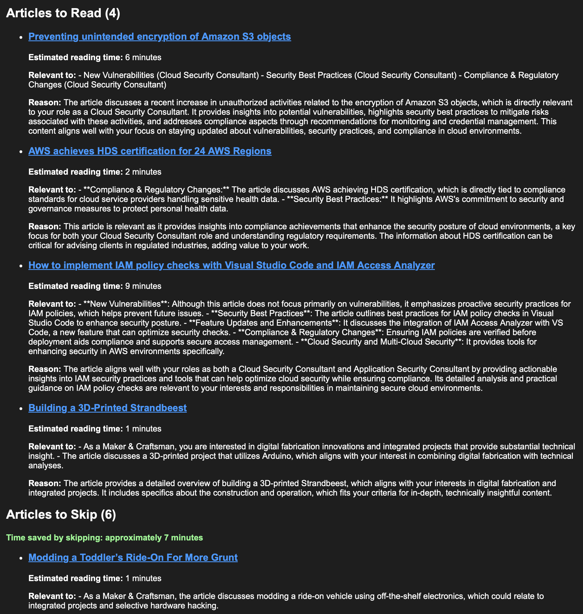

# RSS Feed Analyzer with "AI" Integration

This tool analyzes RSS feeds using AI to help you discover relevant articles based on your interests. It processes multiple RSS feeds, analyzes the content using AI (supports both OpenAI and Ollama), and can save interesting articles to Raindrop.io.

## Features

- Multi-feed RSS processing
- AI-powered content analysis using OpenAI or Ollama
- Email notifications for interesting articles
- Raindrop.io integration for bookmarking
- Smart article filtering based on publication dates
- Markdown content conversion for better analysis
- Configurable feed sources and analysis preferences

## Setup

1. Clone the repository
2. Install dependencies:
   ```bash
   pip install -r requirements.txt
   ```
3. Copy configuration templates:
   ```bash
   cp .env.template .env
   cp config.yaml.template config.yaml
   ```
4. Configure your API keys in `.env`:
   ```
   OPENAI_API_KEY=your_openai_key # https://platform.openai.com/settings/proj_aD2LTbBfWP6jsIE3rY5TtFh9/api-keys
   RAINDROP_TOKEN=your_raindrop_token # https://app.raindrop.io/settings/integrations
   EMAIL_USERNAME=your-email@example.com
   EMAIL_PASSWORD=your-smtp-password
   ```

## Configuration

The tool uses `config.yaml` for its settings. Copy the template and modify it for your needs:

### AI Provider Configuration

For OpenAI:
```yaml
llm:
  provider: "openai"
  model: "gpt-4" # or gpt-3.5-turbo
```

For Ollama:
```yaml
llm:
  provider: "ollama"
  model: "qwen2.5" # or any other supported model
```

### Output Configuration

The analyzer supports two methods for delivering analyzed articles:

#### 1. Email Delivery

Configure in `config.yaml`:
```yaml
email:
  enabled: true
  smtp_server: "smtp.example.com"
  smtp_port: 587
  sender_email: "your-email@example.com"
  recipient_email: "recipient@example.com"
```

Required environment variables in `.env`:
```
EMAIL_USERNAME=your-email@example.com
EMAIL_PASSWORD=your-smtp-password
```

#### 2. Raindrop.io Integration

Configure in `config.yaml`:
```yaml
raindrop:
  enabled: true
  collection: "0"  # Default collection ID
```

Required environment variable in `.env`:
```
RAINDROP_TOKEN=your_raindrop_token
```

You can use either or both methods simultaneously.

### RSS Feeds

Add your RSS feeds to the `rss_feeds` section in `config.yaml`:
```yaml
rss_feeds:
  - https://example.com/feed.xml
  - https://another-site.com/rss
```

## Usage

Run the analyzer:
```bash
python rss_analyzer.py
```

The script will:
1. Fetch new articles from configured RSS feeds
2. Convert articles to markdown for better processing
3. Analyze content using the configured AI provider
4. Save recommended articles to Raindrop.io and/or send email (based on configuration)

## Automation with Cron

You can automate the RSS analyzer to run periodically using cron. Here's how to set it up:

1. Open your crontab configuration:
```bash
crontab -e
```

2. Add a line to run the script weekly (for example, every Monday at 9 AM):
```bash
0 9 * * 1 cd /path/to/rss-ai && /usr/local/bin/python3 rss_analyzer.py
```

Alternatively, you can create a shell script `run_rss.sh`:
```bash
#!/bin/bash
cd /path/to/rss-ai
source venv/bin/activate  # If using a virtual environment
python3 rss_analyzer.py
```

Make it executable:
```bash
chmod +x run_rss.sh
```

Then add it to crontab:
```bash
0 9 * * 1 /path/to/rss-ai/run_rss.sh
```

Note: Make sure to:
1. Use absolute paths in cron jobs
2. Set up environment variables in your shell script if needed
3. Test the script manually before adding it to cron
4. Check cron logs if you encounter any issues

## Example Output

Here's an example of how the LLM analyzes an article:

```text
Processing feed: https://aws.amazon.com/blogs/security/feed/
Last run: 2025-01-14 14:05:26.909940+00:00
Fetching content for: Preventing unintended encryption of Amazon S3 objects
...

Processing feed: https://hackaday.com/feed/
Last run: 2025-01-15 14:05:28.013992+00:00
Fetching content for: Packing Even More Features Into a Classic Radio
...

Found 10 new articles to process

Analyzing article: Preventing unintended encryption of Amazon S3 objects
Decision: Should read
Reason: The article discusses a recent increase in unauthorized activities related to the encryption of Amazon S3 objects, which is directly relevant to your role as a Cloud Security Consultant. It provides insights into potential vulnerabilities, highlights security best practices to mitigate risks associated with these activities, and addresses compliance aspects through recommendations for monitoring and credential management. This content aligns well with your focus on staying updated about vulnerabilities, security practices, and compliance in cloud environments.

--------------------------------------------------------------------------------

Analyzing article: Packing Even More Features Into a Classic Radio
Decision: Skip
Reason: While the article has some relevance to your interests as a Maker & Craftsman, it primarily focuses on a specific hobbyist project related to radios. The content may not offer the comprehensive technical depth or broader implications that you typically seek in articles, especially given that your priorities lie more heavily in cloud and application security, which are not addressed in this piece.
```



## State Management

The tool maintains a `state.json` file to track:
- Last processing time for each feed
- Previously processed articles

This ensures that only new articles are processed in subsequent runs.

## Contributing

Contributions are welcome! Please feel free to submit a Pull Request.
